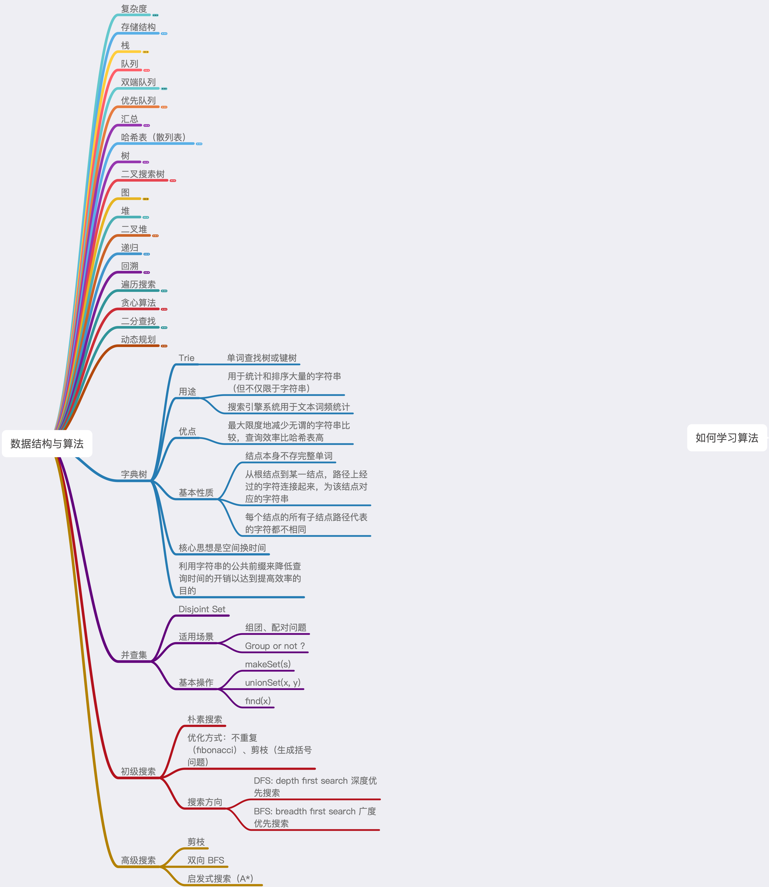

# 学习笔记整理为脑图
    
### 本周作业
- 实现 Trie (前缀树) （亚马逊、微软、谷歌在半年内面试中考过）
- 单词接龙（亚马逊、Facebook、谷歌在半年内面试中考过）
- 最小基因变化（谷歌、Twitter、腾讯在半年内面试中考过）
- 被围绕的区域（亚马逊、eBay、谷歌在半年内面试中考过）
- N 皇后（亚马逊、苹果、字节跳动在半年内面试中考过）
- 括号生成（亚马逊、Facebook、字节跳动在半年内面试中考过）

